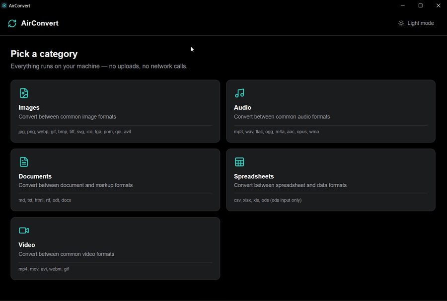

<div align="center">


# AirConvert

**The file converter for machines that can't reach the internet.**

Images, audio, documents, spreadsheets, and video — converted entirely on-device,
with **zero network calls**. No uploads. No cloud service. No phone-home. Ever.

[](#-getting-started)
[](https://tauri.app/)
[](https://react.dev/)
[](https://www.typescriptlang.org/)
[](https://www.rust-lang.org/)
[](#-offline-verification)
[](LICENSE)

[Formats](#-whats-inside) · [Why](#-why-offline-matters-here) · [Offline verification](#-offline-verification) · [Getting started](#-getting-started) · [Roadmap](#-roadmap)

<br />



</div>

---

## ✈️ Why offline matters here

Cloud converters like Convertio or CloudConvert upload your file to a
server, convert it there, and send it back. That's a non-starter on a
locked-down or air-gapped machine — and it's a real privacy concern for
sensitive files even when it isn't.

AirConvert takes the opposite approach:

| Principle | What it means |
| --- | --- |
| 🔒 **Offline by design** | No network request is ever made by the app itself — verifiable at the OS level, not just promised. |
| 🧳 **Everything bundled** | The conversion engines (pure Rust, plus two sidecar binaries) ship with the app. Nothing is fetched at runtime. |
| 🖥️ **Native & lightweight** | A Tauri (Rust) shell instead of Electron — small install, fast startup, low memory. |
| 🕵️ **Your files stay local** | Every conversion happens on-disk, on your machine, and never leaves it. |
| 🧰 **One app, five categories** | Images, Audio, Documents, Spreadsheets, Video — stop juggling five different websites you can't open anyway. |

> Built because I work on internet-restricted VMs at my day job and needed a
> converter that actually works with zero connectivity. Also maintained as
> an open portfolio project, alongside [AirToolkit](https://github.com/Ayoub-EDAHLOULI/AirToolkit).

---

## 🧰 What's Inside

Five format categories, each shipped and verified working before the next
started.

<table>
<tr>
<td valign="top" width="50%">

### 🖼️ Images — pure Rust
- **jpg · png · webp · gif · bmp · tiff**
- **svg** (input, rasterized via `resvg`)
- **ico · tga · pnm · qoi**
- **avif** (output only)
- Optional max-dimension resize
- Optional JPG/WebP quality control

### 🎵 Audio — bundled FFmpeg
- **mp3 · wav · flac · ogg · m4a**
- **aac · opus · wma**

</td>
<td valign="top" width="50%">

### 📄 Documents — bundled Pandoc
- **md · txt · html · rtf · odt · docx**
- Content conversion, not a full-fidelity
  layout engine

### 📊 Spreadsheets — pure Rust
- **csv · xlsx** (input and output)
- **xls · ods** (input only)
- First worksheet only, data values only —
  no formulas, macros, or styling

### 🎬 Video — bundled FFmpeg ¹
- **mp4 · mov · avi · webm · gif**
- **mkv · flv · wmv** (input only)
- Two-pass palette-based GIF encode for
  decent color quality

</td>
</tr>
</table>

Every category shares the same flow: drag and drop (or browse), pick a
target format, convert — with live per-file progress, a Cancel button that
stops the batch after the current file finishes, and an optional output
folder. The last-used format and output folder are remembered per category
between sessions.

<sub>¹ Video shares its FFmpeg binary with Audio — see the
[licensing note](#%EF%B8%8F-engine-choices-and-licensing) below before
distributing a build that includes it.</sub>

### Deliberately out of scope

- **HEIC** — excluded due to HEVC patent licensing ambiguity around
  redistribution, not a technical limitation.
- **AVIF as an input format** — AirConvert converts *to* AVIF but not
  *from* it. Decoding needs the `dav1d` decoder, a much heavier dependency
  than the `ravif` encoder alone.
- **PDF as a conversion target** — investigated and backed out. Pandoc
  renders PDF by delegating to an external LaTeX engine; the lightweight
  option (Tectonic) only supports a genuinely offline local bundle in
  `.zip`/`.ttb` format, while its actual default bundle is published as a
  legacy indexed `.tar` meant to be range-requested live over HTTP — not
  downloaded once and used locally. Revisiting this needs either a real
  offline `.ttb` source or a different engine entirely (e.g.
  `wkhtmltopdf`, which has no package-fetch model at all).
- **PDF editing** (merge/split/compress) — a separate "offline PDF
  toolkit" project, kept out of this repo to stay focused on *conversion*.
- **Full-fidelity Office documents** (complex docx/xlsx/pptx with embedded
  objects, macros, exact layout) — would require a full LibreOffice
  headless install (700MB+), which conflicts with a small, portable bundle.
- **ODS as a conversion target** — there's no mature pure-Rust ODS writer
  comparable to `rust_xlsxwriter` for xlsx, so ODS is input-only.
- **Video resolution/bitrate controls** — ships with fixed, sensible
  codec defaults for now, no quality picker yet.

---

## 🛡️ Offline Verification

"Offline" is a claim worth checking, not just asserting. AirConvert's
zero-network guarantee is verified two ways.

### 1. Static code audit — on every change

Run from the repo root. Each command should return **no matches**:

```bash
# Browser-side network primitives
grep -rn "fetch(\|XMLHttpRequest\|WebSocket\|EventSource\|sendBeacon" src/

# Rust-side network primitives
grep -rn "reqwest\|TcpStream\|UdpSocket" src-tauri/src/
```

Unlike some offline-first apps, AirConvert has **no exception** to carve
out here — there's no HTTP plugin dependency at all (`tauri-plugin-http`
isn't in `Cargo.toml`), and no feature has any reason to make a network
request. Then confirm:

- `src-tauri/tauri.conf.json` has **no** `updater` or analytics block.
  Tauri's auto-updater is opt-in, so its absence means it's off.
- `src-tauri/capabilities/default.json` — the `shell:allow-execute`
  permission is scoped to exactly two named sidecars (`binaries/ffmpeg`,
  `binaries/pandoc`), with no other command execution permitted.

Audio, Video, and Documents shell out to those bundled binaries rather
than calling a Rust crate directly — a real trust boundary worth being
explicit about. Running a local subprocess isn't the same as making a
network call (neither binary makes outbound connections while simply
converting a local file), but it's why the runtime check below covers all
five categories, not just the pure-Rust ones.

### 2. OS-level runtime block — before each release

Build the release binary, block all of its outbound traffic, and confirm
every category still converts identically:

```powershell
# Build first: npm run tauri build
$exe = "src-tauri\target\release\airconvert-desktop.exe"
New-NetFirewallRule -DisplayName "AirConvert-Block-Out" -Direction Outbound `
  -Program (Resolve-Path $exe) -Action Block
```

With the rule active, convert a batch across all five categories —
including an SVG input, an AVIF output, an audio file, a video exported to
GIF (which runs FFmpeg twice), a document through Pandoc, and a
spreadsheet. Everything should behave exactly as on an unblocked run, since
no part of any pipeline touches the network.

Clean up afterwards:

```powershell
Remove-NetFirewallRule -DisplayName "AirConvert-Block-Out"
```

> 💡 For an even stronger guarantee, run the build inside a
> network-isolated VM (no virtual NIC, or a host-only adapter with no NAT).

**Status:** the static audit passes against the current codebase with no
unexpected matches. The OS-level firewall/VM run has not yet been
performed against a signed release build.

---

## 🚀 Getting Started

### Prerequisites

- [Node.js](https://nodejs.org/) (LTS)
- [Rust](https://www.rust-lang.org/tools/install) (stable)
- Tauri's Windows prerequisites — Microsoft C++ Build Tools and WebView2
  ([guide](https://tauri.app/start/prerequisites/))
- Two sidecar binaries **not checked into the repo** — see
  [Sidecar setup](#-sidecar-setup) below. Without them, the Rust build
  itself fails (Tauri validates declared `externalBin` resources at build
  time), not just the affected feature at runtime.

### Run in development

```bash
git clone https://github.com/Ayoub-EDAHLOULI/airconvert-desktop.git
cd airconvert-desktop
npm install
npm run tauri dev
```

### Build a release binary

```bash
npm run tauri build
```

The MSI and NSIS installers are written to
`src-tauri/target/release/bundle/`. See the
[licensing note](#%EF%B8%8F-engine-choices-and-licensing) before
distributing a build that includes Video's codecs.

### 📦 Sidecar setup

Audio, Video, and Documents call bundled binaries rather than a Rust crate —
no pure-Rust option covers this format breadth with acceptable fidelity.
Neither binary is committed to the repo (both are large, and FFmpeg's
licensing varies by build — see below), so each needs to be fetched once
per machine:

**FFmpeg** (Audio + Video)
1. Download the **LGPL** static Windows build from
   [BtbN/FFmpeg-Builds](https://github.com/BtbN/FFmpeg-Builds/releases) —
   specifically `ffmpeg-master-latest-win64-lgpl.zip`. Don't substitute a
   GPL build (e.g. gyan.dev's "essentials" builds): see
   [Engine choices and licensing](#%EF%B8%8F-engine-choices-and-licensing)
   below for why this specific build matters.
2. Place `ffmpeg.exe` (inside the zip's `bin/` folder) at
   `src-tauri/binaries/ffmpeg-x86_64-pc-windows-msvc.exe` (the
   target-triple suffix is Tauri's sidecar naming convention — run
   `rustc -vV` for the right suffix on another platform/architecture).

**Pandoc** (Documents)
1. Download a release for Windows from
   [pandoc.org/installing.html](https://pandoc.org/installing.html) (the
   zip archive, not the installer) or
   [github.com/jgm/pandoc/releases](https://github.com/jgm/pandoc/releases).
2. Place `pandoc.exe` at `src-tauri/binaries/pandoc-x86_64-pc-windows-msvc.exe`.

---

## 🏗️ Tech Stack

| Layer | Technology |
| --- | --- |
| Native shell | [Tauri 2](https://tauri.app/) (Rust) — packaging, file dialogs, sidecar processes |
| UI | [React 19](https://react.dev/) + [TypeScript](https://www.typescriptlang.org/) + [Tailwind CSS](https://tailwindcss.com/) |
| Build | [Vite](https://vite.dev/) |
| Images | `image`, `resvg` — pure Rust, no external binaries |
| Audio / Video | Bundled FFmpeg sidecar |
| Documents | Bundled Pandoc sidecar |
| Spreadsheets | `calamine`, `rust_xlsxwriter`, `csv` — pure Rust |

### ⚖️ Engine choices and licensing

FFmpeg's licensing depends on which build you use. Common "essentials"-style
builds (e.g. gyan.dev's) are **GPL**-licensed because they bundle
`libx264`/`libx265`, and bundling GPL code into a distributed binary
carries GPL's copyleft obligations for that binary — not something to
inherit by accident.

AirConvert bundles [BtbN's **LGPL-only** FFmpeg build](https://github.com/BtbN/FFmpeg-Builds/releases)
instead (`ffmpeg-master-latest-win64-lgpl.zip`), which excludes
`libx264`/`libx265` entirely (`--disable-libx264 --disable-libx265` in its
own build configuration). mp4/mov output uses `libopenh264` — Cisco's
BSD-licensed, patent-fee-prepaid H.264 encoder — instead of `libx264`, so
Video still produces real H.264 rather than falling back to a lower-quality
codec like mpeg4. webm (`libvpx`-vp9) and all of Audio's codecs
(`libmp3lame`, `libopus`, `libvorbis`, `flac`, `wmav2`, `aac`) are present
in this build with no changes needed. Every format and codec path was
re-verified end-to-end against this exact binary before it was adopted.

---

## 🗺️ Roadmap

Phased by format category, one shipped and verified working before the
next started.

<details>
<summary><b>Phase 1 — Images</b> ✅ pure Rust, no external binaries</summary>

- [x] jpg, png, webp, gif, bmp, tiff, svg, ico, tga, pnm, qoi
- [x] avif (output only)
- [x] Max-dimension resize
- [x] JPG/WebP quality control

</details>

<details>
<summary><b>Phase 2 — Audio</b> ✅ bundled FFmpeg sidecar</summary>

- [x] mp3, wav, flac, ogg, m4a
- [x] aac, opus, wma

</details>

<details>
<summary><b>Phase 3 — Documents</b> ✅ bundled Pandoc sidecar</summary>

- [x] md, txt, html, rtf, odt, docx
- [x] PDF export investigated and deliberately backed out (see above)

</details>

<details>
<summary><b>Phase 4 — Spreadsheets</b> ✅ pure Rust</summary>

- [x] csv, xlsx (input and output)
- [x] xls, ods (input only)

</details>

<details>
<summary><b>Phase 5 — Video</b> ✅ stretch goal, shares the Audio FFmpeg sidecar</summary>

- [x] mp4, mov, avi, webm, gif
- [x] mkv, flv, wmv (input only)
- [x] Two-pass palette-based GIF encode

</details>

**Up next:** a completed OS-level offline verification run against a
signed release build.

---

## 🤝 Contributing

Issues and pull requests are welcome. The one non-negotiable rule:
**no new network calls.** Any change must keep the static audit above
clean, and new dependencies must be fully bundleable (no runtime CDN or
remote assets).

## 📄 License

Released under the [MIT License](LICENSE).

<div align="center">
<br />
<sub>Built for the machines the internet forgot. ✈️</sub>
</div>
